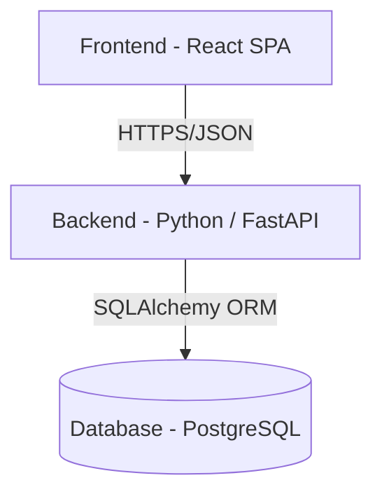

# 🚀 PSI 2026 - Student Projects Catalogue

Repository with supporting code for PSI (Pokročilé Softwarové Inženýrství) course at Technická Univerzita of Liberec (_TUL_).

Primarily the repository hosts a demo project - **Student Projects Catalogue** (_SPC_) - which is a catalogue of student projects created at various courses at TUL and supports evaluating courses and peers.

## User scenarios

The **Student Projects Catalogue**:
* Lists student IT projects developed at TUL (for example within PSI).
   * Allows filtering by technologies, names, subjects, academic term, and students.
* Provides details about a selected project (link to GitHub & live app, list of authors, description).
* Authenticated lecturers can create subjects, seed student projects (by supplying a project title and student owner email), and submit per-project evaluations with scores and textual feedback across multiple configurable criteria.
* Authenticated students receive an invite to complete their project details (title, repository link, live app link, description, technologies, and team members). They can also submit course feedback and peer feedback for teammates.
* Students can view the evaluations and feedback they received once all lector and peer feedback for their project has been submitted.

## 🛠️ Tech Stack

The following diagram depicts the layout of the project components and core technologies:

## 📖 Documentation

* This `README.md` contains quick introduction to the product, onboarding guide, local setup of the project and a rough user guide.
* [`docs/SPECIFICATION.md`](docs/SPECIFICATION.md) (in-progress) provides product-oriented description: business objectives and motivation, planned user scenarios, functional requirements and scope.
* [`docs/DESIGN.md`](docs/DESIGN.md) (in-progress) contains engineering-oriented documentation: technical architecture, UML diagrams, API contracts and DB schema.

## 💻 Local development

Currently the app only contains a prototype, see the [prototype/README.md](prototype/README.md) for instructions how to run it locally and in Google AI Studio.

## 🔍 Examples

* [`examples/monitoring`](examples/monitoring/README.md) — FastAPI app demonstrating BigTech monitoring best practices: structured logging, Prometheus metrics, distributed tracing with OpenTelemetry/Jaeger. Includes a Docker Compose stack (Jaeger + Prometheus + Grafana).

TODO(ljezek): Add support for local development using Docker.

## 🎯 Project milestones

* **Milestone 1: prototype** (3.3.2026): Specification, prototype & high-level design.
* **Milestone 2: mvp** (7.4.2026): MVP is ready, CI/CD is working (dev environment).
* **Product launch** (5.5.2026): Final demo, code/test/documentation is ready, deployed to Azure (dev & prod) with NFRs met (monitoring).

## 👥 Team

* **Roman Špánek** (@roman-spanek) – Clean code, Git, UML, Testing, CI/CD
* **Lukáš Ježek** (@ljezek) – AI-assisted development, Infrastructure, Azure
* **Jana Vitvarová** (@janavitvar) – Planning, SCRUM

## 📊 NFR Status

TODO(ljezek): Complete the following items to fulfill the NFRs of PSI:
* [ ] Production: Link to the app in Production and Dev environments
* [ ] Monitoring: Link to Azure App Insights (monitoring dashboard)
* [ ] Tests: Link to code coverage and latest unit & integration test results on `main` branch
* [ ] CI/CD: Link to GitHub actions forming fully autonomous delivery of (working) code from `main` through `dev` to `prod` environments in a selected cloud (Azure is recommended).
* [ ] SLO: Aiming at 99.5% availability - provide a link to SLI dashboard