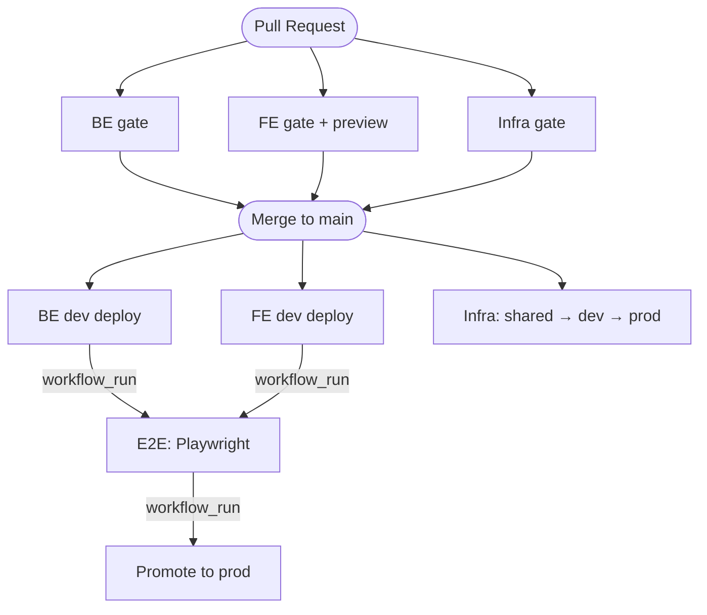
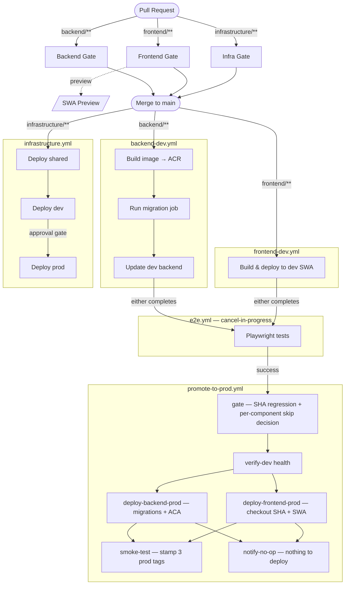

# CI/CD Pipeline Guide

This document covers the full pipeline topology, per-change-type behaviour, and operational runbooks for the Student Projects Catalogue (SPC) project.

For Azure resource architecture see [DESIGN.md](DESIGN.md). For the initial Azure setup see [infrastructure/README.md](../infrastructure/README.md).

---

## Pipeline Overview Diagram



---

## Pipeline Detail Diagram



---

## Pipeline Overview

### Trigger Chain

```
Push to main
  ├─ backend/**        → Backend Deployment (Dev)  ─┐
  ├─ frontend/**       → Frontend Deployment (Dev) ──┼─→ E2E Tests ─→ Promote to Production
  ├─ infrastructure/** → Infrastructure Deployment (shared → dev auto; prod auto-triggered, gated by GitHub env approval)
  └─ data/**           → Validate JSON (PR gate only)

Pull Request to main
  ├─ backend/**        → Backend Gate (ruff + pytest)
  ├─ frontend/**       → Frontend Gate (eslint + vitest) + Preview SWA deploy
  ├─ infrastructure/** → Infrastructure Gate (az bicep build)
  └─ data/**           → Validate JSON
  (no app changes: skip workflows satisfy branch-protection checks)
```

### Workflows

| Workflow file | Trigger | Target |
|---|---|---|
| `backend.yml` | PR (backend/**) | Branch protection gate — no deployment |
| `frontend.yml` | PR (frontend/**) | Branch protection gate + SWA preview |
| `infrastructure-pr.yml` | PR (infrastructure/**) | Branch protection gate (bicep build) |
| `backend-dev.yml` | Push to main (backend/**) or manual | Dev backend Container App |
| `frontend-dev.yml` | Push to main (frontend/**) or manual | Dev Static Web App |
| `infrastructure.yml` | Push to main (infrastructure/**) or manual | Shared + dev Bicep (auto); prod Bicep (auto-triggered, gated by GitHub environment approval) |
| `e2e.yml` | After backend-dev or frontend-dev completes | Local docker-compose stack |
| `promote-to-prod.yml` | After E2E passes or manual | Prod backend + prod SWA |

---

## Behaviour by Change Type

| Change type | Dev auto-deploy | E2E triggered | Backend promoted to prod | Frontend promoted to prod |
|---|---|---|---|---|
| **Backend only** | `backend-dev` runs | Yes | Yes | Skipped — `frontend/` source unchanged since last prod deploy |
| **Frontend only** | `frontend-dev` runs | Yes | Yes — falls back to the last E2E-validated backend image (walks git history, not "latest in ACR") | Yes |
| **All parts** | Both run | Yes (concurrency keeps one E2E) | Yes | Yes |
| **Infrastructure only** | `infrastructure.yml` runs: shared → dev auto, prod gated | No | No | No — infra changes do not trigger app promotion |
| **Data / other** | No | No | No | No |
| **Re-run of same SHA** | n/a | n/a | Skipped — backend image already running in prod | Skipped — frontend source unchanged |

### Why frontend is skipped on backend-only changes

The gate compares `frontend/` source between `promotedFrontendSha` (the commit the current prod frontend was built from) and the incoming SHA using `git diff --name-only`. On a backend-only commit the diff is empty, so the frontend deploy job is skipped entirely. This avoids an unnecessary SWA build/deploy whose output would be byte-for-byte identical to what is already live.

### Why backend is always deployed on frontend-only changes

When a frontend-only commit has no backend Docker image in ACR, the gate walks `git log -- backend/` backwards (up to 20 commits) and picks the most recent ancestor that has an image. Any commit that has an image was built by `backend-dev.yml`, deployed to dev, and had E2E tests pass against it — it is E2E-validated, not just "latest in ACR". The deploy decision then compares that resolved image against `promotedBackendSha`; if they are the same, the backend is skipped too.

### Infrastructure changes and prod

Infrastructure changes are automatically deployed to dev. **Prod infrastructure is auto-triggered but gated** — the `infrastructure.yml` workflow runs `shared → dev → prod` sequentially on every push, but the `prod` job requires a reviewer to approve it via the GitHub `prod` environment protection rules before it executes. To deploy prod infrastructure manually (e.g. without a push):

1. Go to **Actions → Infrastructure Deployment → Run workflow**
2. Set `environment` to `prod`
3. Approve the environment gate when prompted, then monitor in the Azure Portal

---

## Automatic Promotion: How It Works

After E2E tests pass on `main`, `promote-to-prod.yml` runs up to six jobs:

```
gate
  └── verify-dev          (skipped if both components are already up to date)
        ├── deploy-backend-prod ──┐  (parallel; skipped if backend image unchanged)
        └── deploy-frontend-prod ─┤  (parallel; skipped if frontend/ source unchanged)
                                  ├── smoke-test      (runs if at least one deploy succeeded)
                                  └── notify-no-op    (runs if both deploys were skipped)
```

### gate
Runs without a GitHub environment (uses the main-branch OIDC credential). Performs the following checks and decisions:

1. **E2E conclusion**: for `workflow_run` triggers, skips everything if E2E didn't succeed.
2. **SHA regression check**: reads the `promotedSha` Azure tag from `ca-spc-prod-backend`. Uses `git merge-base --is-ancestor` to detect if the incoming SHA is older than what is currently live. Blocks all downstream jobs if so.
3. **Backend image resolution**: checks ACR for an image tagged with the promoted SHA. If none exists (frontend-only commit), walks `git log -- backend/` (up to 20 commits) to find the most recent ancestor commit that has an ACR image — this is guaranteed to be E2E-validated. Outputs `backend_sha` with the resolved image tag.
4. **Per-component deploy decision**: reads two component-level Container App tags — `promotedBackendSha` (image currently running) and `promotedFrontendSha` (commit the current prod frontend was built from) — and independently sets `deploy_backend` and `deploy_frontend`:
   - `deploy_backend=true` when `backend_sha ≠ promotedBackendSha`
   - `deploy_frontend=true` when `git diff promotedFrontendSha sha -- frontend/` is non-empty
   - Both are `true` unconditionally when `force=true` or on the first-ever deployment

### verify-dev
Polls the live `ca-spc-dev-backend` `/health` endpoint. Skipped automatically when both `deploy_backend` and `deploy_frontend` are false (nothing to deploy). Prod promotion is blocked if dev itself is unhealthy.

### deploy-backend-prod
Skipped when `deploy_backend=false` (image already running in prod). Otherwise: re-reads the live `promotedSha` tag immediately after any approval wait and aborts if it changed (prevents a stale approval from overwriting a newer deployment). Promotes the same Docker image that was deployed to dev — no rebuild. Runs Alembic migrations first via `job-spc-prod-migrate`; if migrations fail, the Container App update is never attempted and the previous image keeps running.

### deploy-frontend-prod
Skipped when `deploy_frontend=false` (frontend source unchanged). Otherwise: re-reads the live `promotedSha` tag immediately after any approval wait and aborts if it changed (same stale-approval guard as the backend job). Checks out the exact promoted SHA and rebuilds the frontend with the prod backend URL baked in. Deploys to `swa-spc-prod`.

### smoke-test
Polls prod `/health` with retries. On success, stamps **three tags** on `ca-spc-prod-backend`:
- `promotedSha` — always; used by the SHA regression check.
- `promotedBackendSha` — only if backend was deployed; records the image now running.
- `promotedFrontendSha` — only if frontend was deployed; records the source commit the frontend was built from.

Each tag is only updated for the component that was actually deployed, so a backend-only promotion does not overwrite the frontend stamp and vice-versa.

### notify-no-op
Runs instead of smoke-test when both deploy jobs were skipped (both components already up to date in prod). Writes a step summary confirming nothing was deployed so the successful workflow run is not mistakenly interpreted as a deployment.

---

## SHA Anti-Regression

Three tags on `ca-spc-prod-backend` track what is currently live in production:

| Tag | Meaning | Updated by |
|---|---|---|
| `promotedSha` | Overall commit SHA last successfully smoke-tested | Every successful smoke test |
| `promotedBackendSha` | Backend Docker image SHA currently running | Smoke test, only when backend was deployed |
| `promotedFrontendSha` | Commit SHA the live frontend was built from | Smoke test, only when frontend was deployed |

The SHA regression check uses `promotedSha`:

```
git merge-base --is-ancestor <new-sha> <promotedSha>
```

If this returns true, the new SHA is an ancestor (i.e. older) of what is already live → promotion is blocked with a clear log message.

`promotedBackendSha` and `promotedFrontendSha` are used for the per-component skip decisions described in the gate section above. Keeping them independent means a backend-only deployment never incorrectly resets the frontend stamp, and vice-versa.

**Parallel-PR scenario**: PR1 (all changes) and PR2 (frontend-only) are merged close together. PR2's pipeline is faster and promotes first, stamping its SHA. PR1's SHA is older in git history → gate blocks PR1's promotion. Prod retains PR2's (newer) frontend.

To intentionally bypass (for rollback), use `workflow_dispatch` with `force=true` — see Rollback below.

---

## Manual Operations

### Force-deploy a specific SHA to prod

Use this when you want to deploy a specific commit without waiting for the full pipeline:

1. Go to **Actions → Promote to Production → Run workflow**
2. Enter the full commit SHA in the `sha` field
3. Leave `force` unchecked (unless rolling back — see below)
4. Click **Run workflow** and monitor the run

The gate will resolve the correct backend image for the SHA (either the SHA's own image, or the most recent E2E-validated ancestor) and independently decide whether each component needs deploying.

### Rollback prod

> Alembic down-migrations are not used in this project. Rolling back is only safe if the old code is compatible with the current database schema (i.e. you have not dropped columns or tables). Additive migrations are always safe to roll back.

1. Find the target SHA:
   - `git log --oneline main` — shows recent commits
   - Azure Portal → `ca-spc-prod-backend` → Tags → check `promotedBackendSha` for the image currently running; check revision history for the previous image tag
2. Confirm the image exists in ACR:
   ```bash
   az acr repository show-tags --name <acr-name> --repository backend | grep <short-sha>
   ```
3. Go to **Actions → Promote to Production → Run workflow**
4. Enter the SHA and check **"Skip SHA regression check"** (`force: true`)
   - `force=true` bypasses the regression check **and** skips the per-component skip logic — both FE and BE are deployed unconditionally from the target SHA.
5. Click **Run workflow** and monitor

After a successful rollback, all three tags (`promotedSha`, `promotedBackendSha`, `promotedFrontendSha`) are stamped with values from the rollback target. Future automatic promotions from E2E will be blocked until a newer commit is merged and its pipeline succeeds.

### Deploy infrastructure to prod

```bash
# Option A: GitHub Actions UI
# Actions → Infrastructure Deployment → Run workflow → environment: prod

# Option B: Azure CLI (for emergency or validation)
az deployment group create \
  --resource-group rg-spc-prod-pl \
  --template-file infrastructure/environment.bicep \
  --parameters env=prod ...
```

### Retrigger a dev deployment manually

Both `backend-dev.yml` and `frontend-dev.yml` support `workflow_dispatch`. Go to **Actions → [Backend|Frontend] Deployment (Dev) → Run workflow**.

---

## Troubleshooting

### "Promote to Production" workflow skipped immediately

**Symptom:** The workflow runs but all jobs except `gate` are skipped. Gate logs show: *"SHA X is older than currently promoted Y"*.

**Cause:** The SHA anti-regression check blocked promotion because another pipeline already promoted a newer commit.

**Fix:** No action needed in most cases — the correct version is already live. If you intended to deploy this specific SHA, use `workflow_dispatch` with `force=true`.

---

### `deploy-backend-prod` skipped on a full-stack PR

**Symptom:** `deploy-backend-prod` shows as "skipped" even though both backend and frontend changed.

**Cause:** The gate resolved `backend_sha` to the same image already running in prod (`promotedBackendSha`). This can happen if the backend image for this SHA was already promoted by an earlier pipeline run that E2E validated.

**Fix:** No action needed — the correct backend image is already live. The frontend will still be deployed if source changed.

If you believe the backend *should* have changed, check:
1. Whether `backend-dev.yml` completed successfully for this SHA
2. The `promotedBackendSha` tag on `ca-spc-prod-backend` in the Azure Portal
3. If the image is genuinely different, use `workflow_dispatch` with the SHA and `force=true`

---

### Backend image missing for a specific SHA

**Symptom:** Gate logs show *"No backend image found in the last 20 backend commits"* — `deploy_backend=false` unexpectedly.

**Cause:** `backend-dev.yml` failed (or was never triggered) for the last 20 commits that touched `backend/`.

**Fix:**
1. Check whether `backend-dev.yml` completed successfully for any recent backend-touching commit
2. If it failed, fix the issue and re-run via `workflow_dispatch` on that commit
3. Once an image exists in ACR, use `workflow_dispatch` to promote the desired SHA

---

### "Verify Dev is Healthy" failed

**Symptom:** `verify-dev` exits with *"Dev backend unhealthy"*.

**Cause:** The live dev backend is not responding 200 on `/health`. This could be a bad migration, a container crash-loop, or a transient startup issue.

**Fix:**
1. Check `ca-spc-dev-backend` in the Azure Portal → Log stream
2. Check Application Insights → `ai-spc-dev` for recent exceptions
3. Fix the issue on dev (re-run `backend-dev.yml` if needed)
4. Once dev is healthy, the next E2E run will re-trigger prod promotion automatically, or use `workflow_dispatch`

---

### Migration failed in prod

**Symptom:** `Run Migrations` step fails with logs showing a SQL error.

**Cause:** An Alembic migration was incompatible with the prod database state.

**Fix:**
1. The Container App was NOT updated — the previous version is still running
2. Fix the migration in code and push a new commit
3. The new commit will go through the full pipeline: dev deploy → E2E → prod promotion
4. Do NOT manually run migrations against prod without the pipeline

---

### Smoke test failed after successful deployment

**Symptom:** Both deploy jobs succeeded but `smoke-test` fails after retries.

**Cause:** The backend was deployed but is not healthy — likely a runtime error, misconfigured environment variable, or database connectivity issue.

**Fix:**
1. The `promotedSha`, `promotedBackendSha`, and `promotedFrontendSha` tags were NOT updated (stamps only happen after smoke test passes)
2. Check `ca-spc-prod-backend` → Log stream in the Azure Portal
3. Check Application Insights → `ai-spc-prod` for exceptions
4. If needed, activate the previous Container App revision:
   ```bash
   az containerapp revision list \
     --name ca-spc-prod-backend \
     --resource-group rg-spc-prod-pl \
     --query "[].{name:name, active:properties.active, image:properties.template.containers[0].image}"
   az containerapp revision activate \
     --name ca-spc-prod-backend \
     --resource-group rg-spc-prod-pl \
     --revision <previous-revision-name>
   ```

---

### E2E tests blocked by a cancelled run

**Symptom:** E2E shows as "cancelled" — promote-to-prod was not triggered.

**Cause:** A second push to main cancelled the in-progress E2E run (concurrency: cancel-in-progress: true). Only the most recent E2E run completes.

**Fix:** Wait for the pipeline of the latest commit to complete. If both commits were on the same SHA this is a no-op. If you need to force-promote, use `workflow_dispatch`.

---

## Environment Reference

| Resource | Dev | Prod |
|---|---|---|
| Resource group | `rg-spc-dev-pl` | `rg-spc-prod-pl` |
| Backend Container App | `ca-spc-dev-backend` | `ca-spc-prod-backend` |
| Migration Job | `job-spc-dev-migrate` | `job-spc-prod-migrate` |
| Static Web App | `swa-spc-dev` | `swa-spc-prod` |
| Application Insights | `ai-spc-dev` | `ai-spc-prod` |
| pgAdmin | `ca-spc-dev-pgadmin` | Not deployed |
| Backend min replicas | 0 (scale-to-zero) | 1 (always warm) |
| Log retention | 30 days | 90 days |
| Shared ACR | `rg-spc-shared-pl` | same |
| Shared PostgreSQL | `rg-spc-shared-pl` | same |

### GitHub Environments

| Environment | OIDC subject | Secrets |
|---|---|---|
| `dev` | `repo:ljezek/tul-psi:environment:dev` | `JWT_SECRET`, `VITE_LOGIC_APP_FEEDBACK_URL`, `PGADMIN_AAD_CLIENT_ID`, `PGADMIN_AAD_CLIENT_SECRET` |
| `prod` | `repo:ljezek/tul-psi:environment:prod` | `JWT_SECRET`, `VITE_LOGIC_APP_FEEDBACK_URL` |
| *(main branch)* | `repo:ljezek/tul-psi:ref:refs/heads/main` | Repo-level: `AZURE_CLIENT_ID`, `AZURE_TENANT_ID`, `AZURE_SUBSCRIPTION_ID`, `GEMINI_API_KEY` |

The `gate` job in `promote-to-prod.yml` uses the main-branch OIDC credential (no `environment:` tag) so it runs automatically without triggering prod environment protection rules.

---

## Adding a New GitHub Environment

When adding the `prod` environment for the first time, you also need an OIDC federated credential:

```bash
APP_OBJECT_ID=$(az ad app list --display-name gh-actions-spc --query "[0].id" -o tsv)
az ad app federated-credential create --id "$APP_OBJECT_ID" --parameters '{
  "name": "gh-actions-spc-prod",
  "issuer": "https://token.actions.githubusercontent.com",
  "subject": "repo:ljezek/tul-psi:environment:prod",
  "audiences": ["api://AzureADTokenExchange"]
}'
```

See [infrastructure/README.md](../infrastructure/README.md) for the full initial setup checklist.
