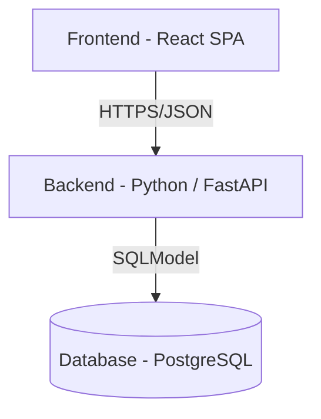
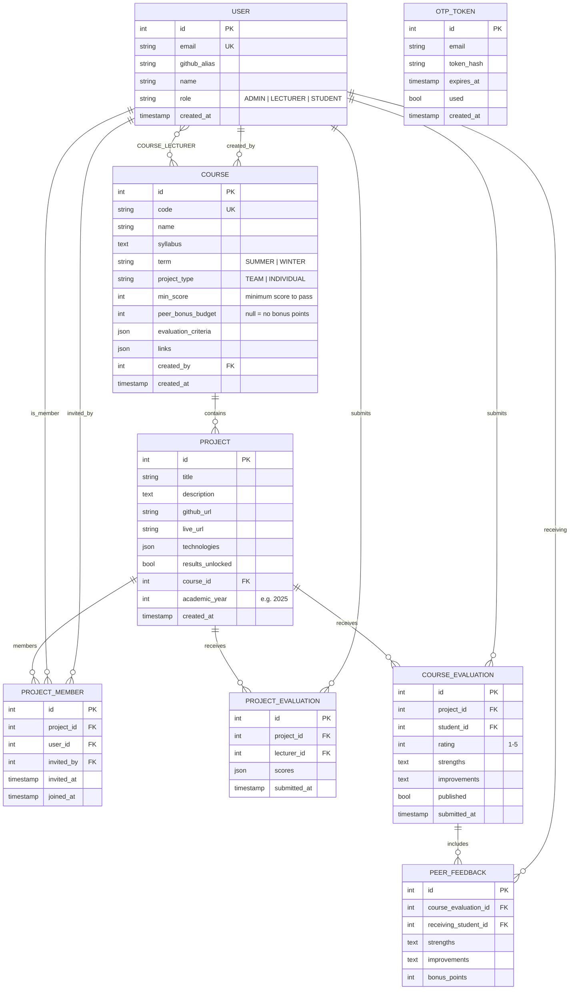
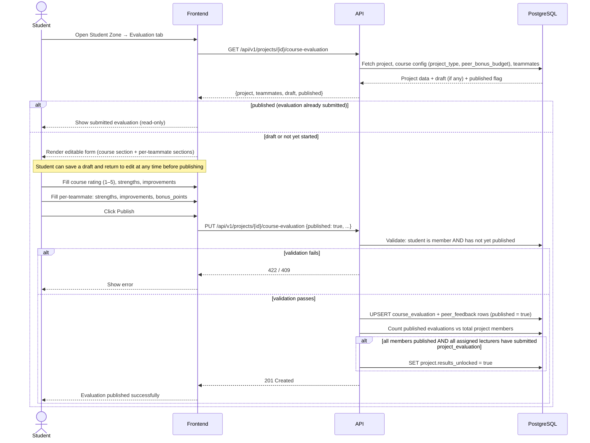
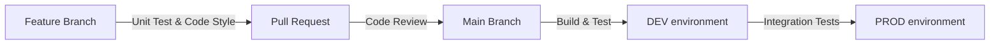
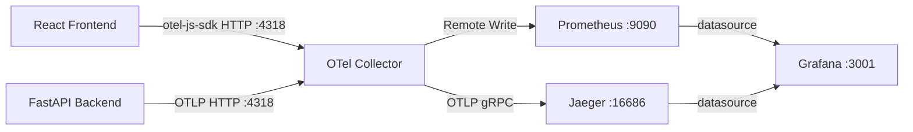
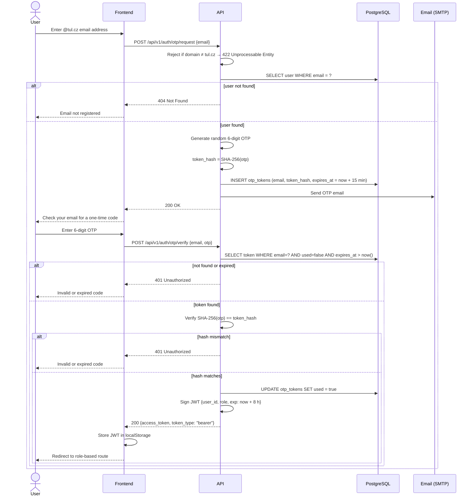

# Design Doc

This document presents the technical plan for implementing the Student Projects Catalogue project. For a high-level overview see [/README.md](../README.md); for business requirements see [SPECIFICATION.md](./SPECIFICATION.md).

## System Architecture Overview

The following diagram depicts the layout of the project components and core technologies:



* **Frontend** (React Single Page Application):
   * Vite and Tailwind CSS
   * `ProjectDashboard`: Displays the list of all student projects.
   * `ProjectDetails`: View for specific project info, including links to GitHub and live app.
   * `EvaluationModule`: Forms for Student Course Evaluation, Lecturer Project Evaluation, and Student Peer Feedback.
   * `State Management` (React Query): Handles data fetching and caching.
* **Backend** (Python / FastAPI):
   * `Auth Middleware`: Validation of authentication state (validates JWT).
   * `Course Service`: Logic for CRUD operations on courses (including academic terms and project configuration).
   * `Project Service`: Logic for CRUD operations on projects, including student invite flow.
   * `Evaluation Service`: Business logic for lecturer evaluations (per-criteria scoring) and peer review.
   * `Persistence Layer`: Interface for database communication (using SQLModel)
* **Database** (PostgreSQL)
* **Infrastructure**
   * Monitoring: Storage for monitoring data and logs.
   * Testing: pytest for unit and integration tests; Playwright for UI tests.
   * Deployment: Azure Cloud, GitHub Actions (CI/CD)
   * Local development: Docker

## Data Model

### Entity Relationships



### JSONB Column Formats

**`COURSE.evaluation_criteria`** — configured once per course by ADMIN. `code` is a short immutable identifier used as the foreign key in `PROJECT_EVALUATION.scores`; `description` is the student-facing label:

```json
[{ "code": "code_quality",  "description": "Code Quality & Architecture", "max_score": 25 },
 { "code": "documentation", "description": "Documentation & README",       "max_score": 20 },
 { "code": "presentation",  "description": "Final Presentation",           "max_score": 15 }]
```

**`COURSE.links`** — arbitrary list of labelled URLs:

```json
[{ "label": "eLearning",       "url": "https://elearning.tul.cz/..." },
 { "label": "STAG",            "url": "https://stag.tul.cz/..." },
 { "label": "Study Materials", "url": "https://..." }]
```

**`PROJECT_EVALUATION.scores`** — one entry per criterion per lecturer. Each assigned lecturer submits their own `PROJECT_EVALUATION` row; `(project_id, lecturer_id)` is unique. Scores are averaged across all lecturers when computing a student's final result:

```json
[{ "criterion_code": "code_quality", "score": 22,
   "strengths": "Well-structured codebase",
   "improvements": "Add docstrings to the service layer" }]
```

**`PROJECT.technologies`** — flat string array:

```json
["Python", "FastAPI", "React", "PostgreSQL"]
```

### Database Migrations

Schema changes are managed with **Alembic** (the standard migration tool for SQLModel/SQLAlchemy).

| Command | Purpose |
|---|---|
| `alembic revision --autogenerate -m "<description>"` | Generate a migration file from model diff |
| `alembic upgrade head` | Apply all pending migrations |
| `alembic downgrade -1` | Roll back the last migration |

* Migration files live in `migrations/versions/`.
* Every migration **must** include a working `downgrade()` function.
* Migrations are applied automatically on container startup via the `docker-compose.yml` entrypoint.

## Interaction Design

### OTP Authentication Flow

See [Security Architecture](#security-architecture) for the full sequence diagram.

### Student Evaluation Processing

The following sequence covers a student opening and submitting the **Course & Peer Evaluation Form** in the Student Zone.



Results become visible to each student once **both** conditions are met: **all** assigned lecturers have submitted a project evaluation **and** every team member has published their course evaluation. Peer feedback sections are only included in the form for **TEAM** projects; `peer_bonus_budget` on the course controls whether bonus-point distribution is shown (null = disabled). A student passes if their final score (sum of average lecturer criterion scores + average received peer bonus points) meets `COURSE.min_score`.

## API & Interface Specification

All endpoints are prefixed with `/api/v1`. Authenticated routes expect an `Authorization: Bearer <jwt>` header. Required roles are noted inline.

### Auth

| Method | Path | Auth | Description |
|--------|------|------|-------------|
| `POST` | `/auth/otp/request` | – | Request a one-time code |
| `POST` | `/auth/otp/verify` | – | Exchange OTP for JWT |

```json
// POST /auth/otp/request — request body
{ "email": "jan.novak@tul.cz" }
// 200 → { "message": "OTP sent" } · 404 → { "detail": "Email not registered" }

// POST /auth/otp/verify — request body
{ "email": "jan.novak@tul.cz", "otp": "483921" }
// 200 → { "access_token": "<jwt>", "token_type": "bearer" } · 401 → { "detail": "Invalid or expired code" }
```

### Health

| Method | Path | Auth | Description |
|--------|------|------|-------------|
| `GET` | `/health` | – | Liveness / readiness check |

```json
// 200 → { "status": "ok", "version": "1.0.0" }
```

### Users (ADMIN only)

| Method | Path | Auth | Description |
|--------|------|------|-------------|
| `GET` | `/users` | ADMIN | List all users |
| `POST` | `/users` | ADMIN | Create a user |
| `GET` | `/users/{id}` | ADMIN | Get user by ID |
| `PATCH` | `/users/{id}` | ADMIN | Update name or role |

```json
// User schema
{ "id": 1, "email": "jan.novak@tul.cz", "github_alias": "jnovak", "name": "Jan Novák", "role": "STUDENT" }
```

### Courses

| Method | Path | Auth | Description |
|--------|------|------|-------------|
| `GET` | `/courses` | – | List all courses |
| `POST` | `/courses` | ADMIN | Create a course |
| `GET` | `/courses/{id}` | – | Get course details |
| `PATCH` | `/courses/{id}` | ADMIN | Update course |
| `GET` | `/courses/{id}/lecturers` | ADMIN, LECTURER | List assigned lecturers |
| `POST` | `/courses/{id}/lecturers` | ADMIN | Assign a lecturer |
| `DELETE` | `/courses/{id}/lecturers/{user_id}` | ADMIN | Remove a lecturer |
| `GET` | `/courses/{id}/projects` | – | List projects for this course; filter with `?year=2025` |
| `POST` | `/courses/{id}/projects` | LECTURER | Seed a project (assigns course & year; sends invite email to owner) |
| `GET` | `/courses/{id}/evaluation-overview` | LECTURER | Aggregated project scores and peer feedback; filter with `?year=2025` |

```json
// Course schema
{
  "id": 1, "code": "PSI", "name": "Projektový seminář informatiky",
  "syllabus": "...", "term": "WINTER", "project_type": "TEAM",
  "peer_bonus_budget": 10,
  "min_score": 50,
  "evaluation_criteria": [{ "code": "code_quality", "description": "Code Quality & Architecture", "max_score": 25 }],
  "links": [{ "label": "eLearning", "url": "https://..." }, { "label": "STAG", "url": "https://..." }]
}

// POST /courses/{id}/projects — request body
{ "title": "Student Projects Catalogue", "academic_year": 2025, "owner_email": "jan.novak@tul.cz" }
```

### Projects

| Method | Path | Auth | Description |
|--------|------|------|-------------|
| `GET` | `/projects` | – | List projects; query: `q`, `course`, `year`, `term`, `technology`, `student` |
| `GET` | `/projects/{id}` | – | Get project detail |
| `PATCH` | `/projects/{id}` | STUDENT (member), LECTURER | Update title, description, URLs, technologies |
| `POST` | `/projects/{id}/members` | STUDENT (member), LECTURER | Add member by email (creates user if needed; sends notification email with login link) |

```json
// Project schema
{
  "id": 1, "title": "Student Projects Catalogue",
  "description": "...", "github_url": "https://github.com/...", "live_url": "https://...",
  "technologies": ["Python", "FastAPI", "React"],
  "academic_year": 2025,
  "course": { "id": 1, "code": "PSI", "name": "Projektový seminář informatiky", "term": "WINTER" },
  "members": [{ "id": 5, "github_alias": "jnovak", "name": "Jan Novák" }]
}
```

### Evaluations

| Method | Path | Auth | Description |
|--------|------|------|-------------|
| `GET` | `/projects/{id}/course-evaluation` | STUDENT (member) | Get form data: teammates, course config, current draft, published status |
| `PUT` | `/projects/{id}/course-evaluation` | STUDENT (member) | Save draft or publish course evaluation & peer feedback |
| `GET` | `/projects/{id}/project-evaluation` | LECTURER | Get submitted project evaluation |
| `POST` | `/projects/{id}/project-evaluation` | LECTURER | Submit project evaluation |
| `GET` | `/projects/{id}/results` | STUDENT (member) | View received results (only when `results_unlocked = true`) |

```json
// PUT /projects/{id}/course-evaluation — request body
// Set published=false to save a draft; true to lock and publish
{
  "published": true,
  "rating": 4,
  "strengths": "...",
  "improvements": "...",
  "peer_evaluations": [
    { "receiving_student_id": 7, "strengths": "...", "improvements": "...", "bonus_points": 2 }
  ]
}

// POST /projects/{id}/project-evaluation — request body (LECTURER)
// Each assigned lecturer submits independently; (project_id, lecturer_id) is unique.
{
  "scores": [
    { "criterion_code": "code_quality", "score": 22,
      "strengths": "Well-structured codebase", "improvements": "Add docstrings" }
  ]
}
```

## Infrastructure & Deployment

> [!NOTE]
> TODO(ljezek): Populate this once we move to the start of final milestone - Cloud deployment.

Azure cloud environment setup, resource selection, and the CI/CD pipeline architecture

High-level plan:



## Reliability & Observability

### Local Observability Stack

The local development environment ships a pre-wired observability stack (see `examples/monitoring/monitoring/docker-compose.yml`) composed of four containers:

| Container | Image | Port | Purpose |
|-----------|-------|------|---------|
| `otel-collector` | `otel/opentelemetry-collector-contrib` | 4317 (gRPC), 4318 (HTTP) | Central OTLP receiver; fans out to Jaeger and Prometheus |
| `jaeger` | `jaegertracing/all-in-one` | 16686 | Distributed trace viewer |
| `prometheus` | `prom/prometheus` | 9090 | Metrics storage (remote-write receiver enabled) |
| `grafana` | `grafana/grafana` | 3001 | Dashboards; auto-provisioned data sources and an overview dashboard (port 3001 avoids conflict with the React dev server on :3000) |



### Instrumentation

Both the backend and the React frontend emit telemetry signals via the OpenTelemetry SDK.

**Backend** (Python `opentelemetry-sdk`):

**Traces** — every inbound request creates a span. Trace context is propagated to outbound HTTP calls and DB queries, enabling end-to-end trace views in Jaeger.

**Metrics** — emitted with OTLP and stored in Prometheus:

| Metric | Type | Description |
|--------|------|-------------|
| `http_server_requests_total` | Counter | Total inbound HTTP requests |
| `http_server_request_duration` (ms) | Histogram | Inbound request latency |
| `http_client_requests_total` | Counter | Outbound HTTP calls |
| `http_client_request_duration` (ms) | Histogram | Outbound call latency |
| `db_queries_total` | Counter | Total DB query calls |
| `db_query_duration` (ms) | Histogram | DB query latency |

**Logs** — structured JSON emitted to stdout via `python-json-logger`. Each record includes `trace_id` and `span_id` fields for correlation with Jaeger traces.

**Frontend** (`@opentelemetry/sdk-web`):

RUM traces (page loads, route transitions, and `fetch`/`xhr` call spans) are sent directly from the React app to the OTel Collector at `:4318` via OTLP/HTTP. This enables full end-to-end traces from user interaction through the API to the database, visible in Jaeger.

### SLI / SLO Targets

| SLI | Target |
|-----|--------|
| API availability | ≥ 99.5 % over a rolling 30-day window |
| P95 request latency (`GET /api/v1/projects`) | < 300 ms |
| 5xx error rate | < 0.5 % |

Alert thresholds are configured in Grafana and stored in `examples/monitoring/monitoring/grafana/provisioning/`.

## Security Architecture

### OTP Login Flow



OTP tokens are **single-use** and expire after **15 minutes**. Only `@tul.cz` email addresses are accepted — the API returns `422 Unprocessable Entity` for any other domain. Only the SHA-256 hash of the raw OTP is persisted; the plaintext is never stored.

### Additional Security Controls

* **CORS** — strict allowlist of trusted frontend origins configured on the FastAPI app.
* **CSRF/XSRF** — backend validates the `Origin` header; state-changing requests also require an `X-XSRF-Token` header following the Double Submit Cookie pattern.

## Testing Strategy

### Unit Tests

**Backend** — pytest with `pytest-cov`:

* Tests cover the service layer and API route handlers; the persistence layer is replaced with in-memory fakes (the pattern from `examples/monitoring/db/fake_db.py`).
* Coverage target: **≥ 80 %** line coverage, enforced in CI with `--cov-fail-under=80`.
* Run locally: `pytest --cov=app --cov-report=term-missing`

**Frontend** — Vitest + React Testing Library:

* Component-level tests (see `frontend/src/App.test.tsx` as the baseline).
* The API layer is mocked via MSW (Mock Service Worker) — no real network calls.
* Coverage target: **≥ 80 %** branch coverage.
* Run locally: `npm run test`

### Integration / UI Tests (Playwright)

End-to-end tests exercise complete user journeys against a running local Docker environment:

| Test Suite | Key Scenarios Covered |
|---|---|
| `public_discovery` | Filter projects by course / technology / name; open project detail |
| `otp_auth` | Request OTP, enter code, verify redirect to correct role route |
| `student_zone` | Login via invite email link; edit project details; submit course evaluation & peer feedback |
| `lecturer_panel` | Seed a project for a course and year; submit lecturer evaluation |
| `evaluation_unlock` | Results become visible to student after all conditions are met |

Tests run against the Docker Compose stack with a dedicated test database that is wiped and re-seeded from fixtures before each suite.

### CI/CD Quality Gates

| Stage | Checks |
|---|---|
| PR (every push) | Ruff (Python lint + format), ESLint, `pytest` with coverage gate, `vitest` |
| Merge to `main` | All PR checks + Playwright integration tests |
| Deploy to DEV / PROD | _(Azure — milestone 3)_ |
