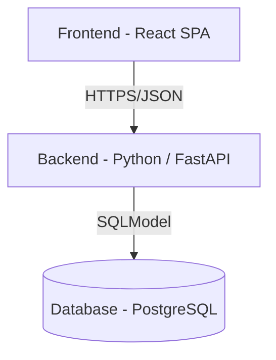
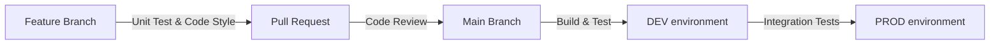

# Design Doc

This document is **work-in-progress**, and will present the technical plan for implementing the Student Projects Catalogue project. Readers should temporarily refer to the [/README.md](../README.md) for high-level design overview and [SPECIFICATION.md](./SPECIFICATION.md) for business objectives of the project.

TODO(ljezek): Populate the rest of the design doc.

## System Architecture Overview

The following diagram depicts the layout of the project components and core technologies:

* **Frontend** (React Single Page Application):
   * Vite and Tailwind CSS
   * `ProjectDashboard`: Displays the list of all student projects.
   * `ProjectDetails`: View for specific project info, including links to GitHub and live app.
   * `EvaluationModule`: Forms for Student Course Evaluation, Lecturer Project Evaluation, and Student Peer Feedback.
   * `State Management` (React Query): Handles data fetching and caching.
* **Backend** (Python / FastAPI):
   * `Auth Middleware`: Validation of authentication state (validates JWT).
   * `Course Service`: Logic for CRUD operations on courses (including academic terms and project configuration).
   * `Project Service`: Logic for CRUD operations on projects, including student invite flow.
   * `Evaluation Service`: Business logic for lecturer evaluations (per-criteria scoring) and peer review.
   * `Persistence Layer`: Interface for database communication (using SQLModel)
* **Database** (PostgreSQL)
* **Infrastructure**
   * Monitoring: Storage for monitoring data and logs.
   * Testing: pytest for unit and integration tests; Playwright for UI tests.
   * Deployment: Azure Cloud, GitHub Actions (CI/CD)
   * Local development: Docker

## Data Model
TODO: ER Diagrams defining the core DB entities and their relationships

## Interaction Design
Sequence diagrams for complex logic, such as OTP authentication flow and Student evaluation processing.

## API & Interface Specification
Definitions of REST endpoints, request/response schemas

## Infrastructure & Deployment
Azure cloud environment setup, resource selection, and the CI/CD pipeline architecture

High-level plan:

## Reliability & Observability
Plan for Logging, Monitoring, Alerting, and defined SLA/SLO/SLI metrics.

## Security Architecture
Auth login flow: backend issues OTP with @tul.cz email and stores it in PostgreSQL. User presents the token and upon validation backend issues JSON Web Token back to the React app which stores it `localStorage`.

Additional planned security: XSRF, CORS.

## Testing Strategy
Overview of Unit, Integration, and UI testing approaches
