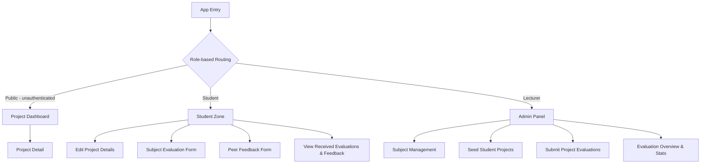

# Product Specification: Student Projects Catalogue

## Product Vision & Target Audience
The **Student Projects Catalogue** is a centralized platform designed for the Faculty of Mechatronics, Informatics and Interdisciplinary Studies at the Technical University of Liberec (_TUL_). Its vision is to provide a centralized repository of various student projects created at TUL and foster a culture of constructive feedback by allowing students to evaluate courses and their peers.

**Target Audience:**
*   **Students:** To present their work, reflect on their learning experience, and provide/receive peer feedback.
*   **Lecturers:** To manage course projects, monitor student collaboration, and gather insights for course improvement.
*   **General Public / Partners:** To explore the innovative outputs of the faculty's students and identify potential talent or collaboration opportunities.

**Success metrics:**
*   More than 90% of students provide course and peer feedback.

## User Scenarios

### 1. Public Project Discovery
A visitor arrives at the site to see the faculty's ongoing and finished projects. They use the **Dashboard** to filter by technologies, project name, subject, academic term, or students. They click on a project card to see a full description, the student team, and links to source code or live demos.

### 2. Lecturer Subject & Project Setup
A lecturer logs in and creates a new subject for the current academic term. For each student project they select the subject and academic term, enter a project title, and provide the email address of the student project owner. The platform sends the student owner an invite link to complete all remaining project details.

### 3. Student Project Editing
After receiving an invite, the student owner logs in and fills in the full project details: title, link to the repository, link to the live application, project description, list of technologies used, and additional team members. Other invited team members can view and edit the same details.

### 4. Student Subject Feedback & Peer Evaluation
After a student completes a project, they switch to the **Student Zone**, where they fill out a subject evaluation to help the lecturer(s) improve the subject for future students.

For team projects, if enabled by the lecturer, students also evaluate their peers: they submit qualitative peer feedback (1 strength and 1 area for improvement) and optionally distribute bonus points. After all project feedback is collected, each student can view their received feedback in an anonymized form.

### 5. Lecturer Project Evaluation
At the end of the term, the lecturer opens the project in the admin panel and submits an evaluation across multiple criteria that were configured for the subject. For each criterion the lecturer provides a numeric score (up to the configured maximum) and textual feedback (1 strength and 1 area for improvement).

### 6. Lecturer Evaluation Overview
The lecturer can view a summary of all project evaluations for the subject and academic year: per-project scores and feedback for every criterion, as well as the average peer feedback scores received by each student.

### 7. Student Evaluation View
Once the lecturer has submitted the project evaluation and all peer feedbacks have been collected, the student can view their evaluation results: lecturer scores and feedback per criterion, as well as anonymized peer feedback they received.

## UX Flow

The application will use OTP-based authentication for Students and Lecturers, and their role is derived from the authenticated account. Public visitors can access the Project Dashboard without authentication.

## Prototype

Working prototype of this application is available at:
[https://ais-dev-wraur5d2xxu7fjsci5byoi-507011329275.europe-west2.run.app](https://ais-dev-wraur5d2xxu7fjsci5byoi-507011329275.europe-west2.run.app) (temporarily hosted on Google AI Studio, the final application will be hosted in Azure - inline with the NFRs below).

## Functional Requirements

### Must have
*   **Project Catalogue:** Searchable and filterable list of student projects (filter by technologies, project name, subject, academic term, and students) with detailed project pages.
*   **Role-Based Access:** Distinct views for Public, Student, and Lecturer roles.
*   **Subject Management:** Lecturer interface to create subjects and configure academic terms.
*   **Project Seeding:** Lecturer provides a project title and the student owner's email address; the platform sends the student owner an invite to complete all remaining project details.
*   **Student Project Editing:** Students can edit their project's title, repository link, live app link, description, technologies, and team members after receiving an invite.
*   **Lecturer Project Evaluation:** Lecturer form to submit evaluations across multiple criteria configured per subject; each criterion has a numeric score (with a configured maximum) and textual feedback (1 strength, 1 area for improvement).
*   **Peer Feedback System:**
    *   Qualitative feedback (1 strength, 1 area for improvement) for each teammate.
    *   Optional bonus point distribution to peers (if enabled for the subject).

### Should have
*   **Subject Evaluation:** Student form for collecting constructive feedback on subject quality and future improvements.
*   **Anonymized Reporting:**
    *    Subject feedback is presented to lecturers without student names to ensure honesty.
    *    Students can view anonymized peer feedback they received to help them grow.
*   **Evaluation Overview:** Lecturers can view per-project scores and feedback across all criteria for the whole subject and academic year, plus average peer feedback scores per student.
*   **Student Evaluation View:** Students can view their lector evaluation results and received peer feedback after all lector and peer feedback for their project has been submitted.
*   **Web and Mobile:** Reactive web app that supports both web and mobile clients.

### Could have
*   **Bilingual Interface:** Full support for Czech and English languages.
*   **Feedback Moderation:** Filtering/flagging of inappropriate comments in the feedback.

## Non-Goals

The following functionality is intentionally Out of Scope of the project:
*   **Integration with TUL SSO:** For simplicity we plan to use One-Time-Password for authentication rather than integration with TUL SSO (Shibboleth).
*   **Direct Messaging:** No real-time chat functionality between users.
*   **Grade Automation:** The system provides data to lecturers but does not automatically calculate final grades.
*   **Asset Hosting:** The platform links to external repositories (GitHub) rather than hosting project binaries or datasets.

## Non-Functional Requirements

*   **Availability & Reliability:** The system must be hosted on Azure with a target availability of 99.5% (SLA), particularly during the final submission and exam periods.
    * **Health checks** must be implemented to facilitate automated instance recovery within the cloud environment.
*   **Scalability:** To handle traffic spikes near project deadlines, the application shall utilize Azure Auto-scaling and capacity planning.
*   **Security:** The platform must implement CSRF/XSRF protection and enforce a strict CORS policy configuration. User authentication will use OTP and secure credential management.
*   **Observability (Monitoring & Logging):** Real-time monitoring, alerting, and logging must be configured using *Azure Application Insights* to track system health and errors.
*   **CI/CD Pipeline:** A fully automated CI/CD pipeline must be established to execute unit and integration tests on every commit to the `main` branch. Successful builds must be automatically deployed to the Azure environment (guarded by quality checks, unit and integration tests).
*   **Code Quality & Maintainability:** The project must adhere to "Clean Code" principles.
    *   All architectural decisions and changes must be **documented** in the repository via Markdown files (README, Spec, and Design Doc).
    *   All code must have consistent **code style**.
    *   No direct commits to the `main` (all changes are made via **Pull Requests with Code Review**).
    *   **Unit tests** with > 80% coverage.